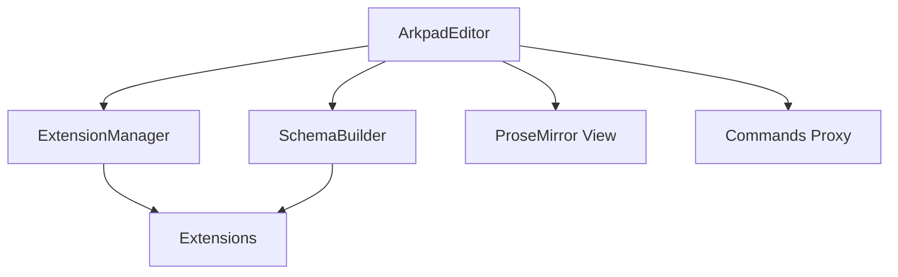

# Arkpad Core Architecture

This document explains the internal design and processing pipeline of the Arkpad editor engine.

## 🏗 High-Level Overview

Arkpad acts as a high-level wrapper around ProseMirror, abstracting away the complexity of schemas and transactions while providing a modern, extension-based API.

## 🚀 The Boot Process

When you create a new `ArkpadEditor` instance, the following sequence occurs:

1.  **Extension Collection**: All provided extensions are flattened and sorted by **Priority**.
2.  **Schema Building**: 
    - `SchemaBuilder` collects nodes and marks from all extensions.
    - `extendNodeSchema` / `extendMarkSchema` hooks are called.
    - Global attributes are patched into all relevant node/mark specs.
    - The final `Schema` is generated.
3.  **Extension Initialization**: 
    - `ExtensionManager` initializes each extension with the editor instance.
    - Extensions register their storage, commands, and interceptors.
4.  **View Mounting**: ProseMirror is initialized with the built schema and plugins.
5.  **Lifecycle Start**: The `onInit()` hook is triggered across all extensions.

## ⚡️ The Transaction Pipeline (Interceptors)

Every change in the editor flows through the Interceptor pipeline. This is where middleware like Unique ID generation, validation, or real-time formatting happens.

1.  **Transaction Dispatched**: User types or runs a command.
2.  **Interceptors Filtered**: The editor checks which interceptors match the transaction type (`docChanged`, `selectionChanged`).
3.  **Middleware Execution**: Interceptors run sequentially. They can modify the transaction, cancel it (return `false`), or pass it through.
4.  **State Application**: The final transaction is applied to the ProseMirror state.

## 🛠 Extension Priority

Priority controls the order in which extensions contribute to the schema and interceptors.

-   **Priority 200+**: Global modifiers (e.g., Unique ID, Typography).
-   **Priority 100**: Standard nodes/marks (Default).
-   **Priority < 100**: Low-level overrides.

## 💎 Command Proxy & Chaining

The `editor.commands` object is a Proxy that dynamically maps to the commands registered by extensions. When you use `editor.chain()`, Arkpad collects commands into a single transaction, executing them only when `.run()` is called, ensuring high performance and a single undo-history entry.

---

Built by **ArkCabin**
