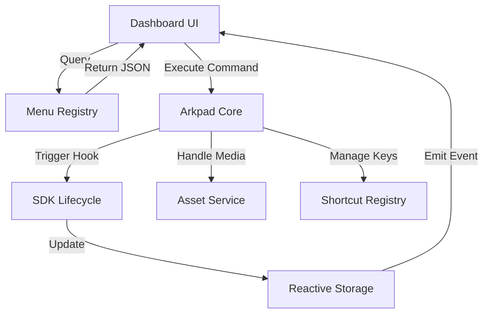

# Arkpad: Modular Core Architecture Guide

This document explains the technical "Flow" and "Design Philosophy" behind the Arkpad Core. It is designed to help you understand how the engine functions as a structure-agnostic power-house for editors and page builders.

---

## 1. The Core Philosophy: "The Engine vs. The Car"
Think of **Arkpad Core** as a highly advanced **Engine**. 
*   It knows how to handle fuel (Data), pistons (Commands), and gears (State).
*   It does **not** know if it is inside a sports car (Page Builder) or a truck (Dashboard).
*   You decide what "Vehicle" to build by plugging in **Extensions**.

---

## 2. Status & Gap Analysis (Have vs. Missing)

The following table shows what is currently implemented in your Core and what we need to add to reach "Page Builder" status:

| Pillar | Capability | Status | Goal |
| :--- | :--- | :--- | :--- |
| **1** | **Reactive Storage** | ✅ Completed | Enable real-time syncing between blocks and UI sidebars. |
| **2** | **Event Bus** | ✅ Completed | Provide a central "Voice" for the engine (EventEmitter). |
| **3** | **SDK Hooks** | ✅ Completed | Standardize `onUpdate`, `onSelection`, and `onInit` across blocks. |
| **4** | **Menu Registry** | ⚠️ Partial | Return JSON metadata for toolbars instead of just coordinates. |
| **5** | **Schema Constraints**| ✅ Completed | Define "Nesting Rules" (Bitmask Governance). |
| **6** | **Asset Service** | ❌ Missing | Centralized media upload and URL management. |
| **7** | **History Engine** | ⚠️ Partial | Add "Milestone Snapshots" beyond simple Undo/Redo. |
| **8** | **Shortcut Registry** | ✅ Completed | Dynamic key-to-command mapping API. |
| **9** | **i18n Bus** | ❌ Missing | Support for multi-locale content in a single structure. |
| **10** | **Batch Service** | ⚠️ Partial | Zero-latency feel via atomic transaction grouping. |
| **11** | **Dynamic Loader** | ❌ Missing | Lazy loading for heavy extensions to keep speed ultra-fast. |
| **12** | **Prefab Engine** | ❌ Missing | Reusable templates and "One-Click Layout" support. |
| **13** | **AI Interface** | ❌ Missing | Enable "Natural Language" page building. |
| **14** | **Advanced Layout** | ❌ Missing | Drag & Drop handles and Grid system. |
| **15** | **Edge Output** | ❌ Missing | Optimize JSON for instant static site generation. |
| **16** | **Governance** | ✅ Completed | Real-time structural auditing (Sentinel). |

---

## 3. The 4-Layer Architecture

### Layer A: The Core Orchestrator (`src/core/`)
- **Responsibility**: Bootstrapping, extension registration, and state synchronization.
- **Key File**: `ArkpadEditor.ts`.
- **Flow**: It initializes the services and acts as the single entry point for the UI.

### Layer B: The API Contract (`src/api/`)
- **Responsibility**: Defining the "language" of the editor.
- **Purpose**: To ensure that the Core and Extensions can talk to each other without knowing each other's internal code.
- **Benefit**: You can change the internal logic of a service without breaking any extensions, as long as the API stays the same.

### Layer C: The Service Layer (`src/services/`)
- **CommandManager**: Handles the execution of actions.
- **MenuEngine**: Generates metadata for toolbars and sidebars.
- **SchemaBuilder**: Generates the structural rules of the document.
- **ExtensionManager**: The "Registry" that keeps track of everything installed.

### Layer D: The SDK (`src/sdk/`)
- **Purpose**: Providing the "Bricks" for building features.
- **Node/Mark/Extension**: Base classes that abstract away complex ProseMirror logic, allowing you to build a "Hero Section" block in just a few lines of code.

---

## 3. The Page Builder Workflow

To build a **Page Builder** using this Core, the flow is:

1.  **Define Layout Nodes**: Create extensions in `packages/extension-layout` (e.g., `Section`, `Column`).
2.  **Use Attributes**: Define attributes like `spacing`, `bg-image`, and `alignment`.
3.  **Custom NodeViews**: Create React components that render these nodes.
4.  **Register with Core**: Pass these layout extensions to the `ArkpadEditor`.
5.  **Build the Toolbar**: Use the `MenuEngine` to get a list of layout actions and map them to your React buttons.

## 4. The 5 Pillars: Detailed Logic Flow

To make the Core a true Page Builder Engine, we will implement these five pillars. Here is the logic for each:

### Pillar 1: The Reactive Storage Service
- **Logic**: Each extension gets its own `storage` object. When a value is updated (e.g., `section.padding = 20`), the Storage Service emits an event.
- **Flow**: `Extension -> Storage.set() -> EventEmitter.emit('update') -> UI Rerenders`.
- **Benefit**: Allows real-time syncing between the editor blocks and the "Settings Sidebar."

### Pillar 2: The Event Bus (EventEmitter)
- **Logic**: A central hub for all editor activity.
- **Key Events**:
    - `transaction`: Emitted every time the document changes.
    - `selection`: Emitted when the cursor or block selection moves.
    - `focus/blur`: Emitted when the user enters or leaves the editor.
- **Benefit**: Third-party plugins can "listen" to the editor without being hardcoded into the core.

### Pillar 3: SDK Lifecycle Hooks
- **Logic**: The `Node` and `Mark` base classes will have standard methods that the Core calls automatically.
- **Hooks**:
    - `onInit()`: Called when the block is first loaded.
    - `onUpdate()`: Called when the block's content or attributes change.
    - `onSelection()`: Called when the user clicks inside the block.
- **Benefit**: Makes it easy to build "Interactive Blocks" (like a Video Player that plays/pauses based on selection).

### Pillar 4: The Menu Metadata Registry
- **Logic**: Instead of buttons, the Core returns **Metadata**.
- **Flow**: `UI -> Request Actions -> Core -> ExtensionManager.getActions() -> JSON Response`.
- **Benefit**: Total UI freedom. You can use the same Core for a Mobile App, a Desktop App, or a Web Dashboard.

### Pillar 6: The Asset Service
- **Logic**: A centralized "Media Manager" for the engine.
- **Purpose**: Handles file uploads, progress tracking, and URL resolution for all blocks.

### Pillar 7: The History & Snapshot Engine
- **Logic**: Advanced versioning and Undo/Redo management.
- **Purpose**: Allows users to save "Milestones" of their page design and revert to them instantly.

### Pillar 8: The Keyboard Shortcut Registry
- **Logic**: A clean API to map physical keys to layout commands.
- **Purpose**: Essential for a "Pro" dashboard experience where speed is key.

### Pillar 9: The Internationalization Bus (i18n)
- **Logic**: Support for multi-locale content within the same JSON structure.
- **Purpose**: Building globally-ready website builders.

### Pillar 10: The Batch & Transaction Service
- **Logic**: Groups multiple operations into a single state update.
- **Purpose**: Ensures "Zero-Latency" feel and prevents UI flickering during complex layout changes.

### Pillar 11: The Dynamic Loader (Lazy Loading)
- **Logic**: On-demand loading of extension code.
- **Purpose**: Keeps the bundle size tiny and the initial load speed ultra-fast.

### Pillar 12: The Template & Prefab Engine
- **Logic**: Management of "Block Groups" as reusable templates.
- **Purpose**: Powers "One-Click Layouts" where users can drop complex pre-built designs.

### Pillar 13: The AI-Command Interface (AI-First)
- **Logic**: A bridge that maps Natural Language to Core Commands.
- **Purpose**: Allows users to build complex dashboards and pages by simply talking to an AI assistant.

### Pillar 14: The Design Token Connector
- **Logic**: Deep synchronization with Figma-style Design Tokens.
- **Purpose**: Ensures 100% brand consistency across all blocks and layouts.

### Pillar 15: Edge-Ready Output
- **Logic**: Optimized JSON serialization for frameworks like Astro, Next.js, and Remix.
- **Purpose**: Enables "Instant" page loads via Edge-Side Rendering (ESR).

### Pillar 16: Automated Governance & Audit
- **Logic**: Real-time scanning for Accessibility (WCAG 2.2) and SEO best practices.
- **Purpose**: Guarantees that every page built is high-quality, accessible, and search-engine optimized.

---

## 7. Status & Gap Analysis (Final Blueprint)

| Category | Pillar | Status | Goal |
| :--- | :--- | :--- | :--- |
| **Infrastructure** | 1-5 | ⚠️ Partial | Events, Storage, Hooks, Menu, Constraints. |
| **Services** | 6-9 | ❌ Missing | Assets, History, Shortcuts, i18n. |
| **Performance** | 10-12| ❌ Missing | Batching, Lazy Loading, Prefabs. |
| **Intelligence** | 13-16| ❌ Missing | AI Driver, Tokens, Edge Output, Auditing. |

---

## 9. Phase 3: The Immortal Engine (Future-Proofing)

To reach the absolute "Best of the Best" status, we will follow these advanced engineering principles:

### 1. Self-Healing Architecture
- **Logic**: A "Validation Middleware" that runs before every state commit.
- **Benefit**: Automatically repairs corrupted JSON data or missing attributes, ensuring the dashboard never crashes.

### 2. Framework-Agnostic Core
- **Logic**: The Core remains 100% Pure TypeScript. React/Vue/Svelte logic is kept in separate "Bridge" packages.
- **Benefit**: Your investment in the Core Engine is protected for the next 10 years, regardless of which UI framework is popular.

### 3. The "X-Ray" Debugger
- **Logic**: A built-in service that exposes the internal state of all 16 pillars to a specialized DevTools panel.
- **Benefit**: Makes building complex custom blocks significantly faster and easier for third-party developers.

### 4. CRDT-First (Real-time by Default)
- **Logic**: Designing the Data Layer to support conflict-free synchronization from Day 1.
- **Benefit**: Collaborative editing (like Google Docs) becomes a "plugin" rather than a difficult refactor.

---

## 11. Implementation Roadmap (Phase-by-Phase)

We will implement the pillars in this specific order to ensure maximum stability:

### Phase 1: Core Infrastructure (The "Nervous System") - ✅ COMPLETED
1.  **[DONE] `src/core/EventEmitter.ts`**: The central communication hub.
2.  **[DONE] `src/core/Storage.ts`**: Reactive state management for extensions.
3.  **[DONE] `src/core/ArkpadEditor.ts`**: Initialize these services and emit standard lifecycle events.

### Phase 2: SDK Standardization (The "Body") - ✅ COMPLETED
1.  **[DONE] `src/sdk/Node.ts`**: Add `onUpdate`, `onSelection`, and `onInit` hooks.
2.  **[DONE] `src/sdk/Extension.ts`**: Standardize how extensions register their `storage` and `commands`.

### Phase 3: Structural Intelligence (The "Rules") - ✅ COMPLETED
1.  **[DONE] `src/core/Governance.ts`**: Implement the bitmask-based nesting logic.
2.  **[DONE] `src/core/ShortcutRegistry.ts`**: Dynamic shortcut management.
3.  **[DONE] `src/core/ArkpadEditor.ts`**: Integrate the Governance Sentinel in the dispatch loop.

### Phase 4: Advanced Services (The "Pro Features")
1.  **Pillar 4 (Menu)**: Export JSON metadata for toolbars.
2.  **Pillar 6 (Assets)**: Central media management.
3.  **Pillar 13 (AI)**: Natural language command mapping.

---

## 12. Technical Specification: Phase 1 (Event Bus & Storage)

### 1. EventEmitter Logic
- **Methods**: `on()`, `off()`, `emit()`, `once()`.
- **Global Instance**: Accessible via `editor.events`.

### 2. Storage Logic
- **Structure**: `Map<string, any>` per extension.
- **Reactivity**: Calls `events.emit('storage:update', { key, value })` on every set.

---

By implementing these 9 pillars, the **Arkpad Core** becomes a "Skeleton" that can support:
1.  **A Rich Text Editor** (Current use case).
2.  **A SaaS Landing Page Builder**.
3.  **A Complex Data Dashboard**.
4.  **A Collaborative Documentation Tool (like Notion)**.

The developer only needs to write the **CSS and Business Logic**; the Core handles the **Data, State, and Infrastructure**.

---

## 7. Summary Flow Diagram

## 13. Core Engine Dependencies (ProseMirror Stack)

To build the "Best of the Best" modular engine, we rely on these specific packages:

| Feature | Package | Role |
| :--- | :--- | :--- |
| **Logic & State** | `prosemirror-state` | Handles the `Transaction` loop and the "Immortality" of the data. |
| **Schema & Rules** | `prosemirror-model` | The foundation for Pillar 5 (Constraints) and `content` expressions. |
| **Rendering** | `prosemirror-view` | Handles the Canvas, NodeViews, and Drag/Drop events. |
| **Visual DnD** | `prosemirror-dropcursor`| Shows the high-fidelity insertion line during block dragging. |
| **Selection** | `prosemirror-gapcursor` | Essential for clicking between blocks (Pillar 14). |
| **Commands** | `prosemirror-commands`| Basic building blocks for the `CommandManager`. |

> [!TIP]
> **Performance Rule**: We avoid "High-Level" wrappers. By working directly with these "Low-Level" packages, we keep the engine **Ultra-Fast** and **Lean**.
